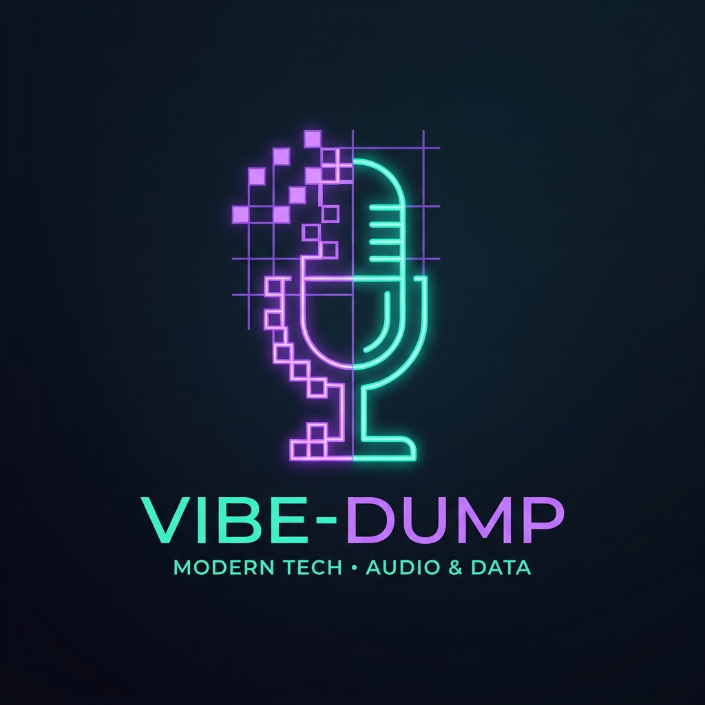
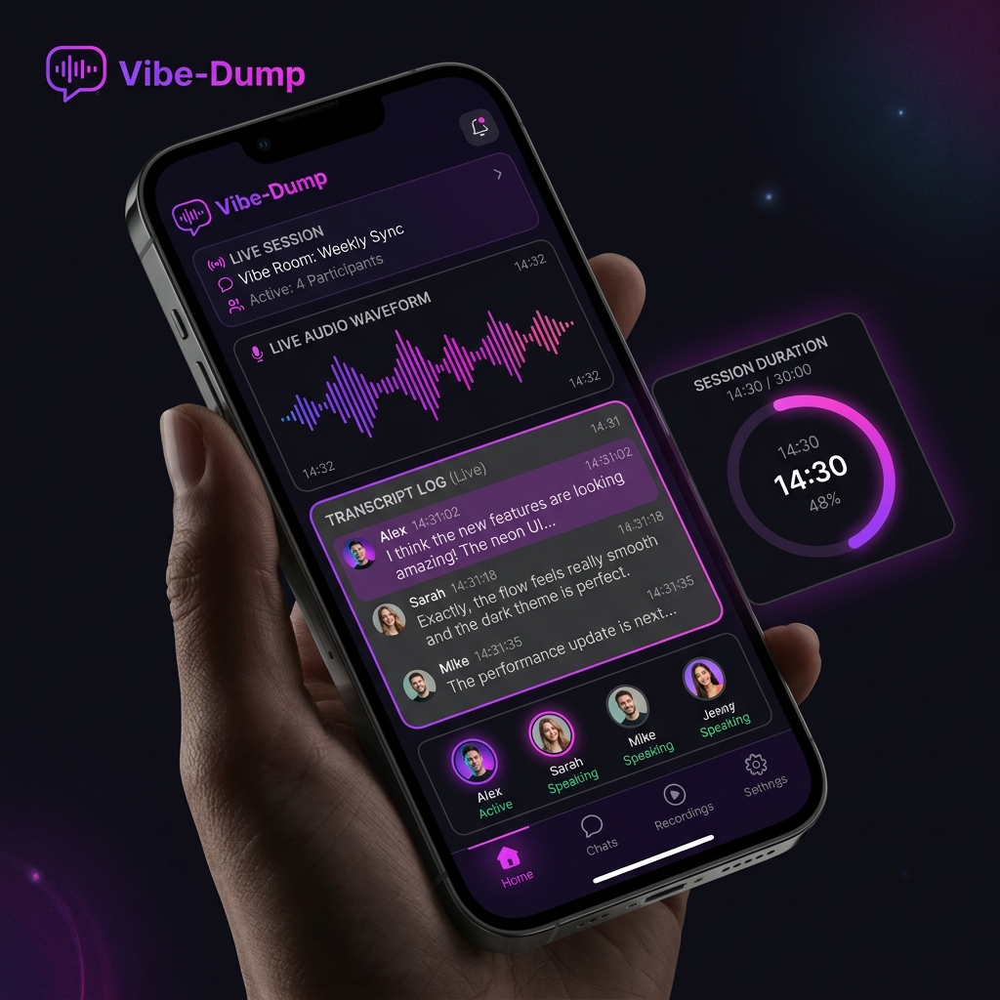

# Vibe-Dump

> **Voice dumps → software blueprints, on a Pi Zero 2 W.**

<div align="center">
  
</div>

<br/>

[](#testing)
[](pyproject.toml)
[](https://fastapi.tiangolo.com)
[](https://ai.pydantic.dev)
[](LICENSE)

Vibe-Dump is a pocket-sized AI spec compiler that transforms chaotic voice notes and audio ideas into structured, dev-ready **Vibe Coding Blueprints**. These blueprints are fully compatible with Cursor, Claude Code, Codex, or Gemini.

The system runs locally as a single Python process on a Raspberry Pi Zero 2 W wearing a Waveshare Whisplay HAT, a PiSugar 3 battery, and a USB microphone. It exposes a modern, mobile-first web dashboard allowing you to drive the active-listening agent, check hardware telemetry, and manage syncs directly from your smartphone over the local network.

---

## 📸 Interface Preview

<div align="center">
  <table>
    <tr>
      <td width="33%" align="center"><strong>Dumpi Mascot (Idle)</strong></td>
      <td width="33%" align="center"><strong>Dumpi Listening</strong></td>
      <td width="33%" align="center"><strong>Mobile Dashboard</strong></td>
    </tr>
    <tr>
      <td></td>
      <td></td>
      <td></td>
    </tr>
    <tr>
      <td align="center"><strong>Developer Settings</strong></td>
      <td align="center"><strong>Storage & Sync</strong></td>
      <td align="center"><strong>Pi Hardware Build</strong></td>
    </tr>
    <tr>
      <td></td>
      <td></td>
      <td></td>
    </tr>
  </table>
</div>

---

## 🔄 How a Vibe-Dump Flows

Vibe-Dump coordinates hardware recording buttons, local audio processing, state machine nodes, and cloud/local LLM providers to synthesize voice transcripts into markdown blueprints.

```
[User Speech] ──► Mic Capture ──► STT (Cloud / Local Whisper) ──► AgentPipeline
                                                                       │
                                                                       ▼
                                                             [State Node: Listening]
                                                             [ASK] Clarifying Question?
                                                             [FINALIZE] Capture Completed
                                                                       │
                                                                       ▼
                                                             Blueprint Compiler (LLM)
                                                                       │
                                                                       ▼
                                                           [Vibe Coding Blueprint]
                                                                       │
                                                                       ▼
                                                             rclone ──► Google Drive
```

The active-listener workflow executes state transitions:
$$\text{Draft} \longrightarrow \text{Listening} \longrightarrow \text{Thinking} \longrightarrow \text{Listening} \mid \text{Ready}$$

Transitions publish events to the event bus (`dump.status`) in real-time, causing the procedural Dumpi mascot to animate dynamically on the Whisplay screen and mobile dashboard.

---

## Features

- **Voice capture** — Push-to-talk recording via USB or 3.5mm mic, exposed to the agent pipeline as in-process WAVs. Works from the web UI, Pi HAT buttons, or mobile dashboard.
- **Whisper STT** — Real `faster-whisper` speech-to-text with a fake fallback for local zero-config testing.
- **Piper TTS** — Text-to-speech readback for audible playback of clarifying questions.
- **7 LLM Providers** — Supports OpenAI, OpenRouter, NVIDIA NIM, Groq, Claude, Gemini, and local Ollama.
- **SQLite FAG / RAG** — FTS5-backed chunk store, BM25 search, chunked transcripts, and sqlite schema integration.
- **Dumpi mascot** — Procedural PIL mascot renderer generating unique palette frames per state.
- **XP / Achievements** — XP progress, profile level-ups, and achievements logged locally.
- **Whisplay HAT** — SPI-driven LCD screen + buttons for physical push-to-talk.
- **PiSugar telemetry** — Battery / voltage / current telemetry polled over I2C.
- **rclone sync** — Automated cloud drive synchronization for blueprints, logs, and capture files.

---

## Quickstart

### One-Line Automated Installer
Deploy Vibe-Dump on your local machine or Raspberry Pi instantly:
```bash
# One-liner (canonical placeholder; replace with the real upstream URL)
curl -fsSL https://raw.githubusercontent.com/<placeholder>/vibe-dump/main/scripts/install.sh | bash

# Or the live public repo:
curl -fsSL https://raw.githubusercontent.com/NaustudentX18/vibe-dump/main/scripts/install.sh | bash
```

### Manual Installation
If you prefer to configure the environment manually:

1. **Clone the repository:**
   ```bash
   git clone https://github.com/NaustudentX18/vibe-dump.git
   cd vibe-dump
   ```

2. **Set up virtual environment:**
   ```bash
   python -m venv .venv
   source .venv/bin/activate
   ```

3. **Install dependencies:**
   ```bash
   # Install the package with Web Dashboard, Dev Utilities, and Pydantic-AI agent extras
   pip install -e ".[web,all]"
   ```

4. **Run the developer dashboard:**
   ```bash
   ./scripts/run_dev.sh
   ```
   The dashboard runs at `http://0.0.0.0:8080`.

---

## Hardware BOM

For full physical details, refer to [docs/HARDWARE.md](docs/HARDWARE.md).

| Qty | Component | Role | Specs & Notes |
| :---: | :--- | :--- | :--- |
| **1** | **Raspberry Pi Zero 2 W** | Compute Engine | 512 MB RAM. Headless configuration. |
| **1** | **Waveshare Whisplay HAT** | Physical Interface | 240×280 ST7789 LCD, 4 custom buttons, WS2812 RGB LED. |
| **1** | **PiSugar 3 Battery HAT** | Power & Telemetry | I2C status readings, UPS mode, 5V boost. |
| **1** | **USB microphone** | Audio Input | Zero 2 W lacks onboard mic/audio ports. |
| **1** | **USB or Bluetooth Speaker** | TTS Readback | Provides voice prompt output. |

---

## ⚙️ Configuration Reference

Copy `.env.example` to `.env` and specify the API keys and configurations you need. All integrations degrade to mocks if variables are omitted.

| Environment Variable | Default Value | Description |
| :--- | :--- | :--- |
| `VIBEDUMP_REGISTRY` | `fake` | Registry mode. Set to `real` for cloud LLM/STT backends. |
| `VIBEDUMP_STT_PROVIDER` | `fake` | Speech-to-Text provider. Options: `fake` or `whisper`. |
| `VIBEDUMP_LLM_PROVIDER` | `fake` | Active listener provider. Options: `openai`, `groq`, `claude`, `gemini`, `local_pc`. |
| `VIBEDUMP_TTS_PROVIDER` | `fake` | Text-to-Speech readback. Options: `fake` or `piper`. |
| `VIBEDUMP_PC_BASE_URL` | `http://desktop-ujsii52.local:11434` | Ollama URL endpoint on your companion PC. |
| `VIBEDUMP_PC_MODEL` | `qwen3-14b-agent` | Companion Ollama model used. |
| `VIBEDUMP_RCLONE_REMOTE` | `gdrive:` | Target destination for cloud drive backup uploads. |

---

## 🧪 Testing

The codebase maintains full coverage across the state machine, SQLite database layers, tool registry, and EventBus.

Run tests using the virtual environment interpreter:
```bash
source .venv/bin/activate
python -m pytest
```

---

## License

This project is licensed under the MIT License. See [LICENSE](LICENSE) for details.
