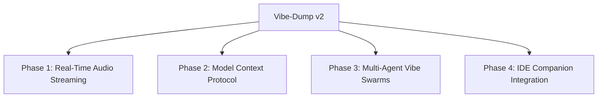

# Vibe-Dump: v2 Feature Roadmap

> **Vision:** Elevating Vibe-Dump from a batch-processed voice recorder to a real-time, low-latency, multi-agent spec compiler that integrates directly with IDEs and leverages state-of-the-art open-source paradigms.

---

## 🗺️ V2 Roadmap Overview



---

## 🚀 Phase 1: Real-Time Audio & Low-Latency Streaming
Currently, Vibe-Dump relies on a "Push-to-Talk" record-then-transcribe loop. v2 will transition the system to real-time voice streaming.

*   **Pipecat / LiveKit Integration:** Integrate **Pipecat** or **LiveKit Agents** to stream voice inputs chunk-by-chunk. This will enable real-time turn-taking and allow users to interrupt the mascot mid-speech.
*   **WebRTC Gateway:** Upgrade the web dashboard to support WebRTC microphone streaming, eliminating temporary local `.wav` files and improving responsiveness.
*   **VAD (Voice Activity Detection):** Incorporate Silero VAD locally on the Pi Zero to segment speech intelligently and suppress background room noise.

---

## 🔌 Phase 2: Model Context Protocol (MCP)
Support for the open standard **Model Context Protocol (MCP)** will turn Dumpi into an active participant in your local development environment.

*   **MCP Host Capabilities:** Enable the agent runtime (`OpenClaude`) to run as an MCP client. This allows the LLM to inspect files, view git status, and check databases to ground its responses in the actual project state.
*   **Mascot Contextual Awareness:** When analyzing a dump, Dumpi can automatically fetch context from open files, matching dependencies and API signatures.

---

## 👥 Phase 3: Multi-Agent Vibe Swarms
Move from a single-LLM compilation step to a team of agents that review and polish your "slop" before exporting.

```
       [Voice Transcript]
               │
               ▼
     ┌───────────────────┐
     │  Architect Agent  │ ──► Drafts initial blueprints
     └───────────────────┘
               │
               ▼
     ┌───────────────────┐
     │   Critic Agent    │ ──► Reviews, flags edge cases & refines
     └───────────────────┘
               │
               ▼
     ┌───────────────────┐
     │ Security Reviewer │ ──► Scans for API secrets/vulnerabilities
     └───────────────────┘
               │
               ▼
       [Polished Turd]
```

*   **Role-Based Agent Pipeline:** Deploy parallel subagents (e.g. `Architect`, `Critic`, `Security Reviewer`) in the SQLite-backed queue, combining their outputs to produce highly structured and secure vibe blueprints.

---

## 💻 Phase 4: IDE & Editor Companion Integrations
Bridge the gap between Vibe-Dump and the editors doing the coding.

*   **Cursor / Claude Code Sync:** Expose a local API server endpoint that Cursor or Claude Code can call. They can read the latest generated blueprint automatically (`/api/dumps/latest/blueprint`).
*   **Hands-Free Workspace Builder:** Generate code outlines and folder structures directly on the Pi Zero or companion desktop PC based on the compiled specifications, making project initialization fully automated.
